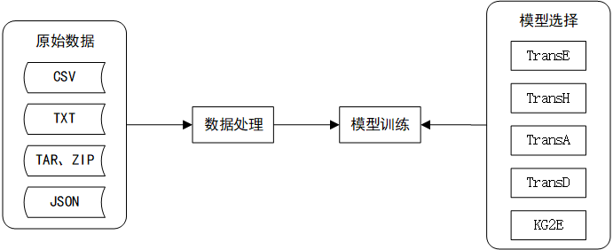

# README

【**简介**】实现知识图谱的表示学习方法——Trans系列，工程旨在构建完整的数据处理、输入，模型搭建、训练、评估流程，以及实现灵活的模型配置和可视化的训练过程。

## 环境配置

+ Python3.6
+ torch1.0.0
+ numpy1.15.4
+ pandas0.22.0

## 运行

+ Step1：将附录中的`FB15k`数据集下载至`data/`目录下。

+ Step2：运行`python GenerateData.py`

+ Step3：运行`python Train.py`

## 数据处理

数据样例内容如下：

```txt
姚明 \t 职业 \t 运动员
```

每一行都是一个三元组，`head`，`relation`和`tail`，通过`\t`或者空格隔开。

数据样例位于工程目录下`/data/`，数据处理样例

```bash
$ python ./GenerateData.py
```

## 模型训练

模型训练需要生成的`实体字典`、`关系字典`、`处理的数据`。

模型训练样例

```bash
$ python ./Train.py
```

## 更新日志

- 2019.5.18
  + 导入工程
  + 增加`TXT`格式原始数据处理，`json`格式字典生成
  + 增加`TransE`模型
  + 增加`MR`评估方法，`dot`相似度评估方法
  
- 2019.5.23
  + 增加`tensorboardX`记录训练`loss`、`MR`
  + 增加日志记录(暂未使用在主代码里面)
  + 增加`evaluation`的`MRR`、`Hit10`评价指标和`cos`、`L2`相似度方法，该部分还需按照具体模型完善
  
- 2019.5.24
  + 增加验证集划分
  + 增加大数据的处理(字典生成和`dataloader`)
  + 修改数据读取方式，增加`.zip`，`.gz`等压缩类型数据处理
  
- 2019.5.28
  + 修复bug，原始数据集部分字符串前后含有空格
  + 增加使用预训练向量初始化
  + 增加训练过程中产生不同负样本集训练
  
- 2019.6.3
  + 增加`TransH`模型
  + 增加`pkl`格式的模型数据保存
  + 增加`TransH`的验证代码，仅`dot`方式和`MR`
  
- 2019.6.5

  + 增加`TransD`模型

    > 未进行评测模型，未完成验证代码

  + 增加`TransA`模型

    > 未进行评测模型，未完成验证代码
  
- 2019.6.14

  + 增加`KG2E`模型

  + 完成`TransE`,`TransH`,`KG2E`模型的统一评测，评测结果如下

    ```
    TransE   321(MR)(300 epochs)
    TransH   390(MR)(130 epochs)
    KG2E_KL  276(MR)(500 epochs)
    KG2E_EL  267(MR)(500 epochs)
  ```
  
  **说明**：模型训练均未训练完，且未进行人工调整参数
  
+ 修复部分代码`bug`
  
+ `TransA`和`TransD`模型说明
  
    + `TransD`模型在验证阶段的效率过低，`1.01个(样例)/秒`的验证速率，时间主要消耗在矩阵`Mrt`和矩阵`EntityEmbedding`的相乘上。
    + `TransA`模型无法理解论文中对于`Wr`的求取的说明，无法求出`Wr`。

## 模型扩展说明

模型扩展需要更新以下部分

+ `config.py`：增加所需参数
+ `Train.py`：更改`trainTriples()`类里面的`loadPretrainEmbedding()`方法和`loadPretrainModel()`方法，`saveModel()`方法，`dumpEmbedding()`方法。
+ `/code/utils/evaluation.py`：更改适应于模型的evaluation方法。

## 代码框架

### 总体框架



## 代码思路

+ 关于数据处理`GenerateData`的想法

  + 数据处理模块化按照步骤可以分为三步`将原始语料处理成标准格式`、`从标准格式数据生成字典`，`分割训练集和验证集`(按需分割)。

+ 关于三元组`Dataloader`的想法

  + 输入数据为正三元组样本，在`Dataloader`中生成负三元组样本，`Dataloader`的输出可以灵活地输出正、负样本。

+ 关于生成负例三元组的想法

  + 假设将所有输入正例三元组看成是`shape(N, 3)`的矩阵，按照论文的要求，要么替换`head`，要么替换`tail`，那么可以生成三个中间向量：

    + `shuffleHead`：将矩阵第一列使用`random.shuffle()`得到的混排的`head`(相当于论文里面所说的随机找一个替换`head`的实体)
    + `shuffleTail`：将矩阵第三列使用`random.shuffle()`得到的混排的`tail`(相当于论文里面所说的随机找一个替换`tail`的实体)
    + `replaceDistribution`：使用`random.random((0, 1))`生成长度为`N`的随机数列表

    那么可以设定一个阈值`repProba`，如果`replaceDistribution`的值小于`repProba`，那么使用`shuffleHead`对应位置的实体替换原来的头实体，反之，使用`shuffleTail`对应位置的实体替换原来的尾实体。可以看出，当`N`足够大时，产生出来的负样本与正样本碰撞的概率几乎为零，基本符合论文要求。

+ 关于模型训练的想法

  + 模型类返回`loss`变量作为优化对象，使用正常的模型训练流程，增加学习率衰减，暂无较大创新之处。

+ 关于`evaluation`的想法

  + 模型的`evaluation`按照四步走的策略，`从训练模型获取必要参数(比如Embedding,MapMatrix等等)`，`将验证集中每个样本和整个EntityEmbedding求相似度`，`求真正的实体对应的rank`，`按照MR，MRR，Hit10使用ranks求得最终分数`。

## 附录

+ [FB15k下载链接](https://everest.hds.utc.fr/lib/exe/fetch.php?media=en:fb15k.tgz)
+ [TransE论文](https://papers.nips.cc/paper/5071-translating-embeddings-for-modeling-multi-relational-data)